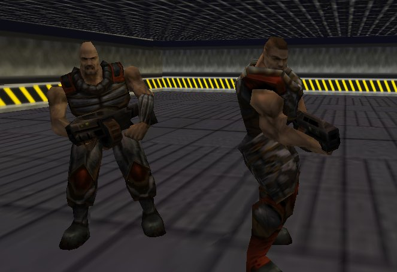



## D3DRM example

### Description

An example about D3DRM with 3D static characters in X files.

For other vb games and demos visit my web site: http://web.tiscali.it/fc_vbgames/index.htm
 
### More Info
 
Microsoft DirectX7

             |
---                |---
**Submitted On**   |2002-01-29 09:01:34
**By**             |[fabio calvi](https://github.com/Planet-Source-Code/PSCIndex/blob/master/ByAuthor/fabio-calvi.md)
**Level**          |Intermediate
**User Rating**    |4.7 (14 globes from 3 users)
**Compatibility**  |VB 6\.0
**Category**       |[DirectX](https://github.com/Planet-Source-Code/PSCIndex/blob/master/ByCategory/directx__1-44.md)
**World**          |[Visual Basic](https://github.com/Planet-Source-Code/PSCIndex/blob/master/ByWorld/visual-basic.md)
**Archive File**   |[D3DRM\_exam515991292002\.zip](https://github.com/Planet-Source-Code/fabio-calvi-d3drm-example__1-31275/archive/master.zip)

